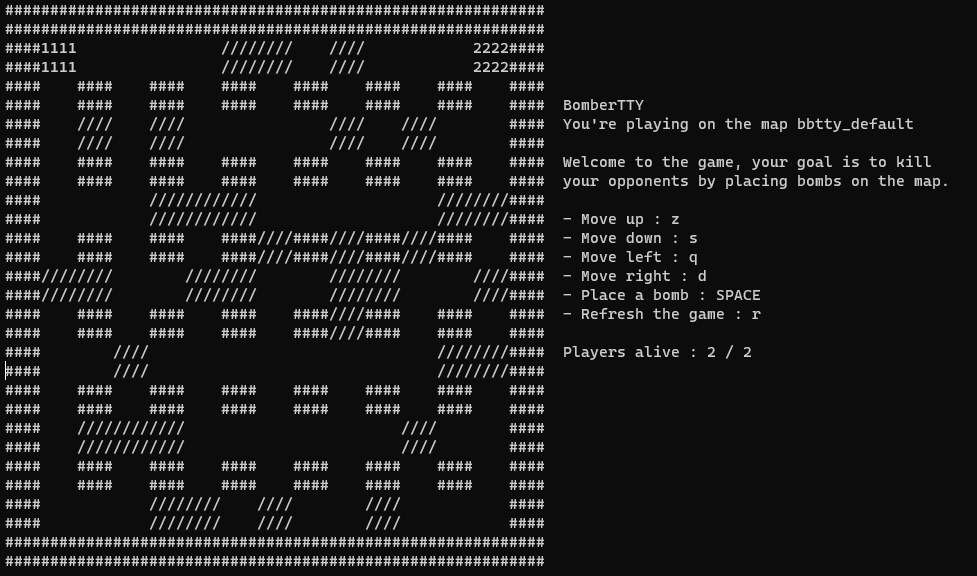

todo :
- Powerup for more bomb range
- cooldown for moving

# BomberTTY

BomberTTY is a terminal based simple bomberman clone entirely written in C, with
help of the ncurses library.

You can play with your friends with up to 4 players, each on a different computer
and connected via SSH.

You can choose between 3 different maps, but you can also create your own with ease.



# Context of the project

This project was made as a school project, which goal was to create a terminal
game using the system programming notions learnt during the lessons :

This game uses threads, mutexes, semaphores and message queues.

# How to play

1. Copy the repository on your computer

```
git clone https://github.com/eNiiju/Bombertty.git
```

2. Compile the project

```
make
```

3. Run the server with the map you want to play on

```
cd server/
./server <path_to_map>
```

4. Run the client on each computer you want to play on

```
cd client/
./client
```

If you are on a different computer, first ssh into the computer running the server, then run the client

```
ssh <username>@<server_ip>
cd <path_to_folder>/client/
./client
```

5. Enjoy !
