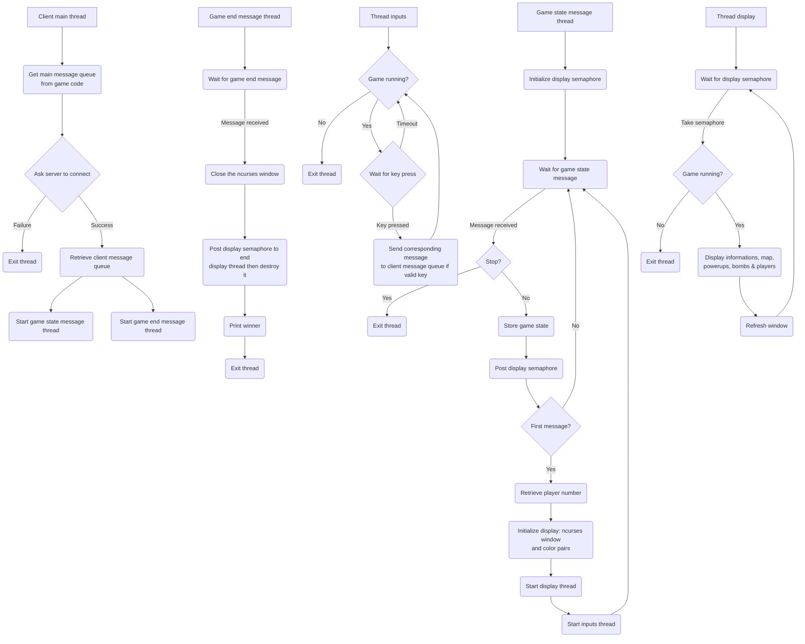

# Client

## Flow chart

```mermaid
graph TD
    MAIN_THREAD[Client main thread] --> MAIN_THREAD_A(Get main message queue\nfrom game code)
    MAIN_THREAD_A --> MAIN_THREAD_B{Ask server to connect}
    MAIN_THREAD_B -->|Failure| MAIN_THREAD_C(Exit thread)
    MAIN_THREAD_B -->|Success| MAIN_THREAD_D(Retrieve client message queue)
    MAIN_THREAD_D --> MAIN_THREAD_E(Start game state message thread)
    MAIN_THREAD_D --> MAIN_THREAD_F(Start game end message thread)

    THREAD_GAME_STATE_MESSAGE[Game state message thread] --> THREAD_GAME_STATE_MESSAGE_A(Initialize display semaphore)
    THREAD_GAME_STATE_MESSAGE_A --> THREAD_GAME_STATE_MESSAGE_B(Wait for game state message)
    THREAD_GAME_STATE_MESSAGE_B -->|Message received| THREAD_GAME_STATE_MESSAGE_C{Stop?}
    THREAD_GAME_STATE_MESSAGE_C -->|Yes| THREAD_GAME_STATE_MESSAGE_D(Exit thread)
    THREAD_GAME_STATE_MESSAGE_C -->|No| THREAD_GAME_STATE_MESSAGE_E(Store game state)
    THREAD_GAME_STATE_MESSAGE_E --> THREAD_GAME_STATE_MESSAGE_F(Post display semaphore)
    THREAD_GAME_STATE_MESSAGE_F --> THREAD_GAME_STATE_MESSAGE_G{First message?}
    THREAD_GAME_STATE_MESSAGE_G -->|No| THREAD_GAME_STATE_MESSAGE_B
    THREAD_GAME_STATE_MESSAGE_G -->|Yes| THREAD_GAME_STATE_MESSAGE_H(Retrieve player number)
    THREAD_GAME_STATE_MESSAGE_H --> THREAD_GAME_STATE_MESSAGE_I(Initialize display: ncurses window\nand color pairs)
    THREAD_GAME_STATE_MESSAGE_I --> THREAD_GAME_STATE_MESSAGE_J(Start display thread)
    THREAD_GAME_STATE_MESSAGE_J --> THREAD_GAME_STATE_MESSAGE_K(Start inputs thread)
    THREAD_GAME_STATE_MESSAGE_K --> THREAD_GAME_STATE_MESSAGE_B

    THREAD_GAME_END_MESSAGE[Game end message thread] --> THREAD_GAME_END_MESSAGE_A(Wait for game end message)
    THREAD_GAME_END_MESSAGE_A -->|Message received| THREAD_GAME_END_MESSAGE_B(Close the ncurses window)
    THREAD_GAME_END_MESSAGE_B --> THREAD_GAME_END_MESSAGE_C(Post display semaphore to end\ndisplay thread then destroy it)
    THREAD_GAME_END_MESSAGE_C --> THREAD_GAME_END_MESSAGE_D(Print winner)
    THREAD_GAME_END_MESSAGE_D --> THREAD_GAME_END_MESSAGE_E(Exit thread)

    THREAD_INPUTS[Thread inputs] --> THREAD_INPUTS_A{Game running?}
    THREAD_INPUTS_A -->|No| THREAD_INPUTS_B(Exit thread)
    THREAD_INPUTS_A -->|Yes| THREAD_INPUTS_C{Wait for key press}
    THREAD_INPUTS_C -->|Timeout| THREAD_INPUTS_A
    THREAD_INPUTS_C -->|Key pressed| THREAD_INPUTS_E(Send corresponding message\nto client message queue if valid key)
    THREAD_INPUTS_E --> THREAD_INPUTS_A

    THREAD_DISPLAY[Thread display] --> THREAD_DISPLAY_A(Wait for display semaphore)
    THREAD_DISPLAY_A -->|Take semaphore| THREAD_DISPLAY_B{Game running?}
    THREAD_DISPLAY_B -->|No| THREAD_DISPLAY_C(Exit thread)
    THREAD_DISPLAY_B -->|Yes| THREAD_DISPLAY_D(Display informations, map,\npowerups, bombs & players)
    THREAD_DISPLAY_D --> THREAD_DISPLAY_E(Refresh window)
    THREAD_DISPLAY_E --> THREAD_DISPLAY_A
```
