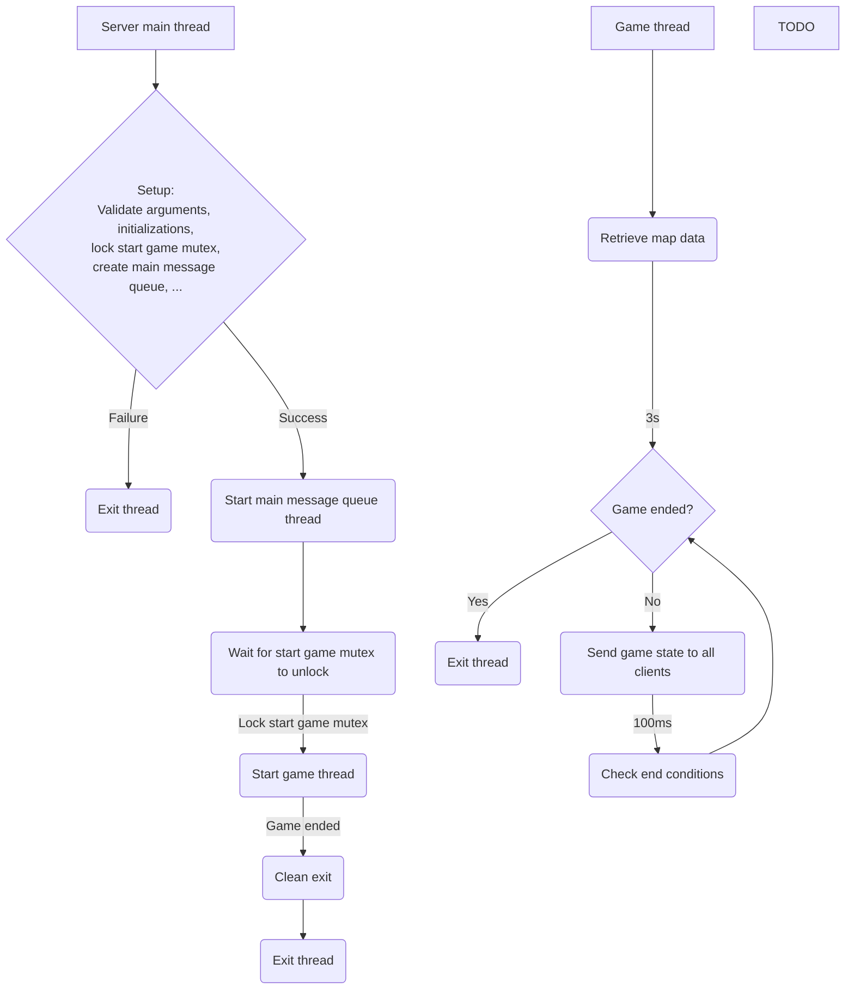

# Server

## Flow chart

```mermaid
graph TD
    MAIN_THREAD[Server main thread] --> MAIN_THREAD_A{Setup:\nValidate arguments, initializations,\nlock start game mutex,\ncreate main message queue, ...}
    MAIN_THREAD_A -->|Failure| MAIN_THREAD_B(Exit thread)
    MAIN_THREAD_A -->|Success| MAIN_THREAD_C(Start main message queue thread)
    MAIN_THREAD_C --> MAIN_THREAD_D(Wait for start game mutex to unlock)
    MAIN_THREAD_D -->|Lock start game mutex| MAIN_THREAD_E(Start game thread)
    MAIN_THREAD_E -->|Game ended| MAIN_THREAD_F(Clean exit)
    MAIN_THREAD_F --> MAIN_THREAD_G(Exit thread)

    THREAD_GAME[Game thread] --> THREAD_GAME_A(Retrieve map data)
    THREAD_GAME_A -->|3s| THREAD_GAME_B{Game ended?}
    THREAD_GAME_B -->|Yes| THREAD_GAME_C(Exit thread)
    THREAD_GAME_B -->|No| THREAD_GAME_D(Send game state to all clients)
    THREAD_GAME_D -->|100ms| THREAD_GAME_E(Check end conditions)
    THREAD_GAME_E --> THREAD_GAME_B

    TODO
```
