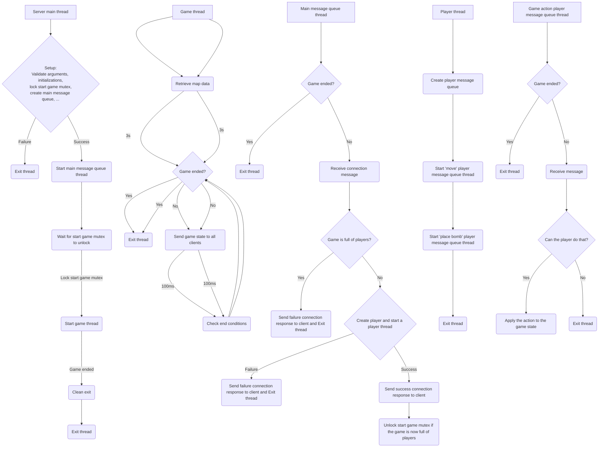

# Server

## Flow chart

```mermaid
graph TD
    MAIN_THREAD[Server main thread] --> MAIN_THREAD_A{Setup:\nValidate arguments, initializations,\nlock start game mutex,\ncreate main message queue, ...}
    MAIN_THREAD_A -->|Failure| MAIN_THREAD_B(Exit thread)
    MAIN_THREAD_A -->|Success| MAIN_THREAD_C(Start main message queue thread)
    MAIN_THREAD_C --> MAIN_THREAD_D(Wait for start game mutex to unlock)
    MAIN_THREAD_D -->|Lock start game mutex| MAIN_THREAD_E(Start game thread)
    MAIN_THREAD_E -->|Game ended| MAIN_THREAD_F(Clean exit)
    MAIN_THREAD_F --> MAIN_THREAD_G(Exit thread)

    THREAD_GAME[Game thread] --> THREAD_GAME_A(Retrieve map data)
    THREAD_GAME_A -->|3s| THREAD_GAME_B{Game ended?}
    THREAD_GAME_B -->|Yes| THREAD_GAME_C(Exit thread)
    THREAD_GAME_B -->|No| THREAD_GAME_D(Send game state to all clients)
    THREAD_GAME_D -->|100ms| THREAD_GAME_E(Check end conditions)
    THREAD_GAME_E --> THREAD_GAME_B

    THREAD_MAIN_MESSAGE_QUEUE[Main message queue thread] --> THREAD_MAIN_MESSAGE_QUEUE_A{Game ended?}
    THREAD_MAIN_MESSAGE_QUEUE_A -->|Yes| THREAD_MAIN_MESSAGE_QUEUE_B(Exit thread)
    THREAD_MAIN_MESSAGE_QUEUE_A -->|No| THREAD_MAIN_MESSAGE_QUEUE_C(Receive connection message)
    THREAD_MAIN_MESSAGE_QUEUE_C --> THREAD_MAIN_MESSAGE_QUEUE_D{Game is full of players?}
    THREAD_MAIN_MESSAGE_QUEUE_D -->|Yes| THREAD_MAIN_MESSAGE_QUEUE_E(Send failure connection response to client and Exit thread)
    THREAD_MAIN_MESSAGE_QUEUE_D -->|No| THREAD_MAIN_MESSAGE_QUEUE_F{Create player and start a player thread}
    THREAD_MAIN_MESSAGE_QUEUE_F -->|Failure| THREAD_MAIN_MESSAGE_QUEUE_G(Send failure connection response to client and Exit thread)
    THREAD_MAIN_MESSAGE_QUEUE_F -->|Success| THREAD_MAIN_MESSAGE_QUEUE_H(Send success connection response to client)
    THREAD_MAIN_MESSAGE_QUEUE_H --> THREAD_MAIN_MESSAGE_QUEUE_I(Unlock start game mutex if the game is now full of players)

    THREAD_GAME[Game thread] --> THREAD_GAME_A(Retrieve map data)
    THREAD_GAME_A -->|3s| THREAD_GAME_B{Game ended?}
    THREAD_GAME_B -->|Yes| THREAD_GAME_C(Exit thread)
    THREAD_GAME_B -->|No| THREAD_GAME_D(Send game state to all clients)
    THREAD_GAME_D -->|100ms| THREAD_GAME_E(Check end conditions)
    THREAD_GAME_E --> THREAD_GAME_B

    THREAD_PLAYER[Player thread] --> THREAD_PLAYER_A(Create player message queue)
    THREAD_PLAYER_A --> THREAD_PLAYER_B(Start 'move' player message queue thread)
    THREAD_PLAYER_B --> THREAD_PLAYER_C(Start 'place bomb' player message queue thread)
    THREAD_PLAYER_C --> THREAD_PLAYER_D(Exit thread)
    
    THREAD_GAME_ACTION_PLAYER_MESSAGE_QUEUE[Game action player message queue thread] --> THREAD_GAME_ACTION_PLAYER_MESSAGE_QUEUE_A{Game ended?}
    THREAD_GAME_ACTION_PLAYER_MESSAGE_QUEUE_A -->|Yes| THREAD_GAME_ACTION_PLAYER_MESSAGE_QUEUE_B(Exit thread)
    THREAD_GAME_ACTION_PLAYER_MESSAGE_QUEUE_A -->|No| THREAD_GAME_ACTION_PLAYER_MESSAGE_QUEUE_C(Receive message)
    THREAD_GAME_ACTION_PLAYER_MESSAGE_QUEUE_C --> THREAD_GAME_ACTION_PLAYER_MESSAGE_QUEUE_D{Can the player do that?}
    THREAD_GAME_ACTION_PLAYER_MESSAGE_QUEUE_D -->|Yes| THREAD_GAME_ACTION_PLAYER_MESSAGE_QUEUE_E(Apply the action to the game state)
    THREAD_GAME_ACTION_PLAYER_MESSAGE_QUEUE_D -->|No| THREAD_GAME_ACTION_PLAYER_MESSAGE_QUEUE_F(Exit thread)
```
